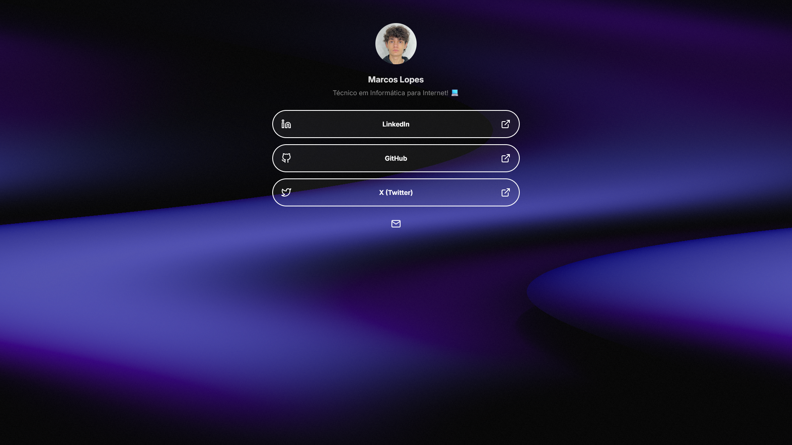

# Coconut Links

> Personal profile link platform, inspired by Linktree.

## Adjustments and improvements

The project is still under development and the next updates will focus on the following tasks:

- [X] Add a bio
